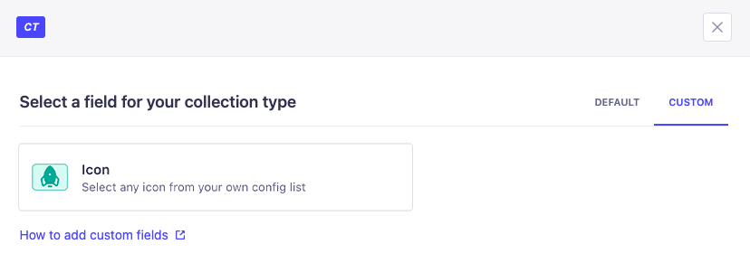
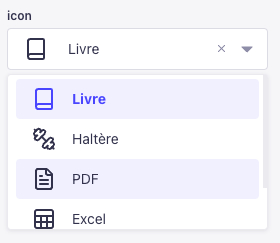
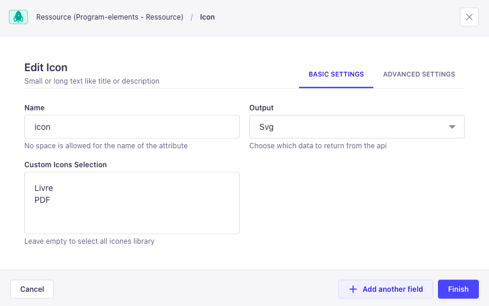

<div align="center" width="150px">
  
  <h1>Strapi Icons Custom Field </h1>
  <p>
    A customizable plugin for Strapi to integrate an icon field into your content types. This plugin allows users to easily select icons for different fields, improving the flexibility and user experience of your Strapi-based CMS.
  </p>
  <p>
   <a href="https://strapi.io">
      
    </a>
  </p>
   
</div>

## Features 🎨

- **Icon Picker**: Adds an icon field to your content types, enabling users to select from a variety of preloaded icons.
- **Customizable**: You can add custom svg icons code directly into the plugin configuration from `plugins.js` or `plugins.ts` file, making this plugin adaptable to any design or theme.
- **Pass SVG go to your API**: No additional package needed on your frontend. You can directly rendered the plugin with a custom component on your frontend.
- **User-friendly**: Simple, intuitive field for content managers to pick and manage icons.

## Installation 🛠️

### 1. Install the Plugin

To get started, you can install the plugin via npm or yarn.

```bash
npm install strapi-plugin-icons-field
```

or if you are using yarn:

```bash
yarn add strapi-plugin-icons-field
```

### 2. Configure the Plugin

Once installed, navigate to your `config/plugins.js` or `config/plugins.ts` file and add the plugin configuration:

```js
module.exports = ({ env }) => ({
  'icons-field': {
    enabled: true,
    config: {
      icons: [
        // Define your own custom icons list here
        {
          name: 'my-icon',
          svg: '<svg xmlns="http://www.w3.org/2000/svg" viewBox="0 0 32 32" width="32px" height="32px" fill="#212134"><path d="M26 ..."></path></svg>',
        },
        // Add more custom icons here
      ],
    },
  },
});
```

```ts
export default ({ env }) => ({
   'icons-field': {
    enabled: true,
    config: {
      icons: [
        // Define your own custom icons list here
        {
          name: 'my-icon',
          svg: '<svg xmlns="http://www.w3.org/2000/svg" viewBox="0 0 32 32" width="32px" height="32px" fill="#212134"><path d="M26 ..."></path></svg>',
        },
        // Add more custom icons here
      ],
    },
  },
});
```

### 3. Rebuild Strapi

After installing and configuring the plugin, rebuild your Strapi instance:

```bash
npm run build
npm run develop
```

or with yarn:

```bash
yarn build
yarn develop
```

## Usage 📋

### Add the Icon Field

Once the plugin is installed, you will be able to add an icon field to any content type.

1. Go to **Content-Types Builder** in the Strapi Admin Panel.
2. Select the content type where you want to add the icon field.
3. Choose **Icon** from the available field types.
4. Configure the field as needed (e.g., allowing custom icons selection or full list by default).
5. Choose the output field format of the API (e.g., Name or SVG)
6. Save and deploy your content type.



### Select an Icon

Once the icon field is added to your content type, you can select an icon from a predefined set or add your own. The icons will be displayed on the content manager interface and can be used for various purposes like UI customization, categorization, and more!

## Select specific icons from config ⚙️

If you don't want to display all your icons in the list, you can select the ones you want to show by tapping their `name` attribute.

This allows your team to leverage icons that match your project or use cases.



---

## Usage in React.js ⚛️

You can easily render the SVG icons from this plugin in your React components using the `Icon` component. This component allows you to pass in the raw SVG code (as a string) and render it directly in your React app.

### Install the `html-react-parser` Dependency

First, ensure you have `html-react-parser` installed, as it's used to parse the SVG code.

```bash
npm install html-react-parser
```

or with yarn:

```bash
yarn add html-react-parser
```

### Render SVG Icons in React

Use the `Icon` component to render SVG icons. Here’s an example:

#### Example Code

```tsx
import React from 'react';
import Icon from '../components/Icon';  // Import your Icon component

export default function Page () {
  const iconSvgCode = `<svg xmlns="http://www.w3.org/2000/svg" viewBox="0 0 24 24" width="24" height="24"><path d="M12 2L2 7l3 11h14L22 7z"/></svg>`; // Example SVG icon code, you should replace with your Strapi API Call
  
  return (
    <div>
      <h1>Render SVG Icon</h1>
      {/* Render the SVG using the Icon component */}
      <Icon icon={iconSvgCode} className="my-icon" />
    </div>
  );
};
```

The homemade component

```tsx
import React, { HTMLAttributes }  from 'react';
import parse from 'html-react-parser';

interface RenderSvgProps extends HTMLAttributes<SVGElement> {
  icon: string;
}

export default function Icon({ icon, ...props }: RenderSvgProps) {
  const parsedElement = icon && parse(icon);
  if (parsedElement && React.isValidElement(parsedElement)) {
    return React.cloneElement(parsedElement, props);
  }
  return null;
}
```

#### Explanation

- **`icon` Prop**: The `icon` prop takes the raw SVG code as a string. You can get this string either from your Strapi CMS or any other source.
- **`props`**: You can pass additional props like `className`, `style`, or `onClick` directly to customize the rendered SVG element.
- **`parse`**: The `parse` function from the `html-react-parser` library is used to convert the SVG code into React elements.

### Customize the SVG

You can also customize the SVG attributes (like `width`, `height`, or `fill`) by passing them as props to the `Icon` component.

#### Example with Custom Props

```tsx
<Icon 
  icon={iconSvgCode} 
  className="custom-icon" 
  width="48" 
  height="48" 
  fill="blue"
/>
```

In this example, the SVG will be rendered with a custom size (`48x48`) and a blue color fill.

---

This section should make it easy for users to integrate the SVG rendering feature in their React app! Let me know if you'd like to tweak anything.

## Contributing 🤝

We welcome contributions! If you'd like to contribute to this project, please fork the repository and create a pull request with your changes.

Before submitting, make sure to:

- Follow the existing code style and conventions.
- Write clear and concise commit messages.
- Ensure tests pass (if applicable).

## License 📜

This project is licensed under the MIT License - see the [LICENSE](LICENSE) file for details.

---

## Support 🆘

If you encounter any issues or have questions, feel free to create an issue on GitHub, and we will get back to you as soon as possible!
